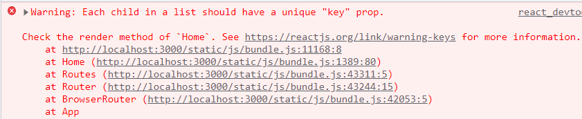

# 2nd Toy Project

## 0. 0주차 설계

퍼소나를 나와 같은 '20대 여성'으로 잡고, 내가 평소에 관심있어하고 좋아하는 것들이나 자주 방문하는 사이트들을 생각해보았다.

1. 쇼핑몰
2. 연예인 관련 정보, 소식 사이트
3. 음악
4. 맛집
5. 술
6. ...

이 중 어떤 것으로 프로젝트 주제를 설정하지 고민하다가 칵테일의 종류가 굉장히 많은데 그 중 항상 어떤 칵테일을 먹어야할지 고민을 했던 기억이 났다. 그래서 칵테일에 대한 정보를 제공하는 사이트가 있으면 좋겠다는 생각이 들었다. 마침 칵테일 API를 제공하는 사이트가 있어 쉽게 정보를 받아올 수 있겠다고 생각하였다.

칵테일 API 제공 사이트

https://www.thecocktaildb.com/api.php

이 사이트에서는 여러가지 기능의 API를 제공하는데, 

1. 칵테일 이름 검색 API (이름을 전체 다 입력하지 않아도 입력된 알파벳이 포함된 칵테일 검색 가능)
2. 각 알파벳으로 시작하는 칵테일 리스트 API
3. 칵테일 재료 정보 API
4. 칵테일 랜덤 추천 API
5. ... 

등의 다양한 기능이 있다.

제공되는 API를 최대한 활용하여 웹사이트를 제작하려고 한다.

**웹사이트 구현 계획**

- 메인 페이지

  1. 칵테일 이름 검색

     -> 한글자씩 입력할 때 마다 자동으로 검색된 칵테일을 화면에 보여줌

  2. 랜덤 칵테일 소개

- 알파벳 검색 페이지

  각 알파벳을 누르면 그 알파벳으로 시작하는 칵테일 소개

- 상세 페이지

  - 칵테일 상세 페이지

    각 칵테일의 사진 / 이름을 누르면 칵테일 상세 페이지로 이동

    1. 이미지
    2. 재료 -> 재료를 클릭하면 재료 소개 페이지로 이동
    3. 관련 태그
    4. 소개말 (영어 외 2가지 언어 제공)
    5. 칵테일 잔

  - 재료 상세 페이지

    1. 재료의 상세 설명
    2. 알코올 도수 표시
    3. 이 재료가 들어간 칵테일

**웹사이트 예시**

1. 메인페이지

   

2. 알파벳으로 검색 페이지

   

3. 상세페이지(칵테일)

   

4. 상세페이지(재료)

   

**추가 구현 원하는 기능**

- 설명이 영어로 되어있기 때문에 API를 이용해서 영어를 한글로 번역

  https://developers.naver.com/docs/papago/papago-nmt-example-code.md

- 여러 카테고리를 나눠서, 알코올, 논알코올, 칵테일 종류, 칵테일잔 종류에 따라 칵테일을 분류하여 찾아볼 수 있는 필터기능


## 1. 1주차 구현 과정

페이지 url 설정

1. 메인페이지

   'http://localhost:3000/'

2. 알파벳 검색 페이지

   'http://localhost:3000/browse/:alpha'

3. 칵테일 상세 페이지

   'http://localhost:3000/cocktail/:id'

4. 재료 상세 페이지

​		'http://localhost:3000/ingredient/:id'

react-router-dom가 업데이트되면서 switch를 지원하지 않는다는 것을 알게되었다.

switch -> Routes로 바뀜 => 헷갈려서 5.3.0으로 다운그레이드해서 코드 작성

```js
{/* App. js */}

import { BrowserRouter as Router, Routes, Route } from 'react-router-dom';
import Home from './Home';

function App() {
  return (
    <Router>
      <Routes>
        <Route path="/">
          <Home />
        </Route>
        <Route path="/browse/:alphabet">
          <BrowseAlphabet />
        </Route>
        <Route path="/cocktail/:id">
		  <CocktailPage />
        </Route>
        <Route path="/ingredient/:id">
      	  <IngredientPage />
        </Route>
      </Routes>
    </Router>
  );
}

export default App;
```

계속 메인페이지 `<Home>` 이외의 다른 페이지가 뜨지 않아서 router 작성을 잘못한 줄 알았는데 상위 경로의 코드(path = '/')가 가장 위에 있으면 다른 페이지 경로를 다 잡아먹기 때문에 안되는 것이었다. => 가장 밑으로 내려서 해결

link to로 클릭하여 다른 페이지로 넘어갈 수 있도록 코드를 작성하였다. 이때 Link to가 연결된 요소를 클릭했을 때 url은 바뀌는데 페이지가 안 넘어가고 새로고침을 한 번 해야지 넘어가는 현상이 있었다. => 스터디원들에게 물어보니 router 버전 문제라고 하여 router 업데이트를 통해 해결

```js
{/* App. js */}

import {
  BrowserRouter,
  Routes,
  Route,
} from "react-router-dom";
import Home from './routes/Home';
import CocktailPage from './routes/CocktailPage';
import IngredientPage from "./routes/IngredientPage";
import BrowseAlphabet from "./routes/BrowseAlphabet"
import { Link } from 'react-router-dom'

function App() {
  return (
    <BrowserRouter>
      <Link to={"/"}><h1>COCKTAIL</h1></Link>
      <hr />
      <Routes>
        <Route path="/browse/:alphabet" element={<BrowseAlphabet />} />
        <Route path="/cocktail/:id" element={<CocktailPage />} />
        <Route path="/ingredient/:name" element={<IngredientPage />} />
        <Route path="/" element={<Home />} />
      </Routes>
    </BrowserRouter>
  );
}
export default App
```

메인 페이지를 제일 아래에 둬야하는 것이 불편했는데 중간 발표를 통해 exact={true}를 추가하면 path 속성에 넣은 경로값이 정확히 URL의 경로값과 일치할 때만 렌더링되도록 할 수 있다는 것을 배웠다.

또, api 주소를 받아올 때 브라우저에서 주소를 입력하면 json이 뜨는데 react에서는 json형식이 아니라 에러가 발생하였다. 

```js
  const search = async(event) => {
    setCocktail(`www.thecocktaildb.com/api/json/v1/1/search.php?s=${event.target.value}`)
    fetch(cocktail).json()
    .then(data => console.log(data));
  }
```

그 원인은 api 주소 앞에 `http://`가 들어가지 않아서 브라우저에서는 자동으로 입력이 되었지만 리액트에서는 안됐던 것이었다.


### 1주차 구현 내용

**1. 메인페이지**


**2. 칵테일 상세페이지**


**3. 재료 상세페이지**


### 1주차 느낀점

중간 발표에서 현재까지 다른 스터디원들의 각자 프로젝트 구현 내용을 들을 수 있었다. 나는 다른 스터디원들과는 다르게 API를 사용하였는데, 너무 많은 기능을 가진 API를 사용하니 스스로 구현한 기능이 매우 적다고 느껴져서 아쉬웠다. 남은 기능인 알파벳으로 칵테일 나열하기를 구현한 후에 css 요소를 좀 더 다양하게 추가하여 멋진 웹사이트를 만들고 싶다!


## 2. 2주차 구현 과정

추가 계획: 원하는 칵테일을 즐겨찾기하고 비교하는 기능 추가!

- 알파벳으로 칵테일 검색하기 기능 구현 완료

- 리액트 CSS

  - 배경색, 기본 글꼴 등 모든 페이지에서 적용할 css는 최상위에 style.css 파일을 만들어서 index.js에 임포트

  - 페이지 맨위 Link to를 이용하여 home으로 가는 글자의 text-decoration을 지워야하는데 쉽지 않았다.

  - ```css
    .text-link {
      text-decoration: none;
      color: #A3876F;
    }
    ```

  - 로 css를 작성했는데 변경이 일어나지 않았다. 검색을 통해 해당 값을 변경하기 위해서는 Link에 클래스를 부여해야 하는 것이어서 Link에 클래스를 주었더니 값이 변경되었다. 그런데 Link to의 속성에 마우스를 hover하면 text가 파란색으로 바뀌어서 이것을 다른 색으로 변경하고 싶었다. .text-link:hover속성을 통해 변경할 수 있었다.

  - ```css
    .text-link:hover {
      color:dimgrey
    }
    ```

  - 파비콘을 이용하여 파비콘을 변경하고, nav에 아이콘을 추가하였다. 아이콘과 텍스트의 위치가 맞지 않아 display:flex, vertical-align: bottom 속성을 추가하여 아래를 기준으로 위치를 정렬하였다.
  
  - card에 마우스를 갖다대면 카드의 크기가 커지도록 구현하고 싶었는데 크기를 부여하면 좌상단을 기준으로 확대가 되는 것이 예쁘지 않았다. 그래서 가운데를 기준으로 확대하는 효과를 검색하여  ` transform: scale(); `이라는 속성을 찾았다. 몇 배를 확대할 건지 숫자를 넣으면 가운데를 기준으로 확대가 되었다.
  
  - 그런데 확대가 되었을 때 다른 카드에 의해 확대된 카드가 가려지는 현상이 있었다. `z-index`속성을 활용하여 가장 앞으로 보내도록 하였다.
  
  - 알파벳으로 검색하는 항목을 fixed로 하여 항상 화면의 아래에 고정되도록 하였다. 모든 페이지에서 보일 수 있도록 새로운 컴포넌트를 만들고 app.js의 라우터 아래에 위치시켰다. 또한, 이 요소에 빈 div요소를 추가하고 높이를 부여해줌으로써 내용이 가리는 현상을 보완하였다.
  
  - 하다보니 css를 임포트 안해도 같은 클래스네임이나 아이디를 지정하면 css가 적용되었다.??
  
- 오류

  - 
  - key값을 칵테일 id로 주었는데 왜 오류가 발생하지??
  - 처음엔 발생하지 않았던 오류... -> Col을 넣어줘서 생긴 현상 div를 넣어도 마찬가지
  - 맵 안에 다른 태그를 넣으면 key 값을 못 주기 때문에 발생 => css로 그리드 구현
  - 
  - 이유를 모르겠는 아이콘 오류
  - 경로설정이 잘못된듯??
  - 기본 react logo 아이콘을 삭제해서 그런것이었음!


### 2주차 구현 내용

**1. 메인페이지**


카드에 마우스를 올려놓았을 때


**2. 칵테일 상세 페이지**


**3. 재료 상세 페이지**


**4. 알파벳으로 검색 페이지**


## 느낀점

미리 와이어프레임을 작성하니 어떤 구문을 작성할지나 css를 적용할 때 훨씬 수월하였다. 기획단계의 중요성을 깨달을 수 있었다.

웹사이트를 만들 때 어떤 사이트를 참고하였는지 꼼꼼하게 기록하는 것이 필요하다고 느꼈다. 중간에 파비콘에 넣는 아이콘이 계속 오류가 났는데 다시 아이콘을 다운 받으려고 하니 어떤 사이트에서 다운 받았는지를 기록해놓지 않아서 찾는데 오랜 시간을 허비하게 되었다. 개발을 할 때 어느 부분에서 어떻게 충돌이 나서 오류가 발생할지 알 수 없으므로 모든 일을 기록해야겠다고 배울 수 있는 계기가 되었다.

1주차가 끝나고 나의 계획은 css를 빨리 끝내고 칵테일 찜하기, 여러가지 필터, 번역 기능 등 추가하고 싶은 기능을 추가하는 것이었지만, 생각만큼 css가 수월하지 않았다. 

또한, css를 계획없이 작성하다보니 가장 상위의 파일에 적용되는 css가 있어서 클래스네임이나 아이디 충돌이 많이 일어났다. 또한 어떤 요소는 클래스를 주고, 어떤 항목은 아이디를 주고 통일성이 없이 코드를 작성하게 되었다. css를 작성할 때에도 어느 정도의 나만의 규율을 세워서 작성해야 겠다고 생각하였다.
