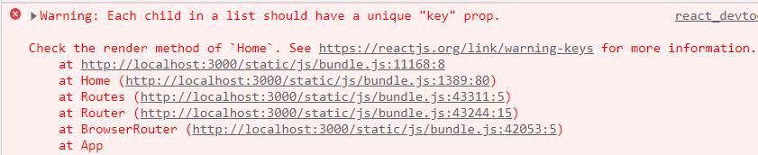
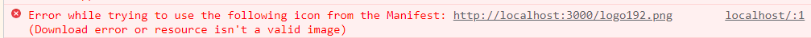

# 2nd Toy Project: 칵테일 소개 페이지


## 구현 목적

- 리액트 JS를 이용하여 사이트 제작하기
- css를 이용하여 웹페이지 꾸미기


## 구현 내용

- 'https://www.thecocktaildb.com/api.php'라는 칵테일 API 사이트에서 데이터를 받아온다.
- 받아온 데이터를 바탕으로 칵테일을 소개하는 사이트를 제작한다.
- components와 routes로 폴더를 나누어 작성하여 코드를 컴포넌트화 하려고 노력하였다.
- 칵테일은 이름 검색과 시작하는 알파벳으로 검색할 수 있다.
- 검색된 칵테일은 카드형식으로 보여지고, 마우스를 올리면 카드의 크기가 커지며 강조된다.
- 카드를 클릭하면 칵테일 상세 페이지로 화면이 전환되고, 칵테일의 재료, 소개, 칵테일에 맞는 잔의 정보가 제공된다.
- 칵테일 상세 페이지에서 칵테일 재료를 클릭하면 칵테일 재료 상세 페이지로 전환되고, 그 재료의 타입, 알코올 여부, 도수 및 재료에 대한 설명이 제공된다.


## 대표코드

### App.js

```js
import {
  BrowserRouter,
  Routes,
  Route,
} from "react-router-dom";
import Home from './routes/Home';
import CocktailPage from './routes/CocktailPage';
import IngredientPage from "./routes/IngredientPage";
import BrowseAlphabet from "./routes/BrowseAlphabet"
import Nav from './routes/Nav'
import Alphabet from "./routes/Alphabet";

function App() {
  return (
    <BrowserRouter>
      <Nav />
      <Routes>
        <Route path="/browse/:alphabet" element={<BrowseAlphabet />} />
        <Route path="/cocktail/:id" element={<CocktailPage />} />
        <Route path="/ingredient/:name" element={<IngredientPage />} />
        <Route path="/" element={<Home />} />
      </Routes>
      <Alphabet />
    </BrowserRouter>
  );
}
export default App
```


**페이지 url 설정**

1. 메인페이지

   'http://localhost:3000/'

2. 알파벳 검색 페이지

   'http://localhost:3000/browse/:alpha'

3. 칵테일 상세 페이지

   'http://localhost:3000/cocktail/:id'

4. 재료 상세 페이지

​		'http://localhost:3000/ingredient/:id'

`<Nav/>`와 `<Alphabet/>`은 route와 관계없이 모든 페이지에 들어있는 요소이다.

`<Nav/>`는 웹사이트의 로고를 나타내고, 클릭하면 메인페이지로 돌아오게 된다. 

`<Alphabet/>`은 알파벳으로 이루어져있고, 알파벳을 클릭하면 해당 알파벳으로 시작하는 칵테일 소개 페이지로 이동한다. 또한 `position:fixed`속성을 통해 항상 브라우저의 하단에 위치하도록 설정하였다.


### routes/Home.js

```js
import { Container, InputGroup, FormControl, Row, Col } from 'react-bootstrap'
import { useState, useEffect } from 'react'
import Cocktail from '../components/Cocktail'
import '../components/Cocktail.css'


function Home() {
  const [loading, setLoading] = useState(true)
  const [searchTerm, setSearchTerm] = useState('')
  const [cocktails, setCocktails] = useState([])
  const search = (event) => setSearchTerm(event.target.value)

  const fetchDrinks = async () => {
    const json = await (await fetch(`https://www.thecocktaildb.com/api/json/v1/1/search.php?s=${searchTerm}`)).json()
    setCocktails(json.drinks)
    setLoading(false)
  }

  useEffect(() => {
    fetchDrinks()
  }, [searchTerm])

  return (
    <div>
      <Container>
        <InputGroup onChange={search} className="mb-3" size='lg'>
          <FormControl
            placeholder="Search for a Cocktail..."
          />
        </InputGroup>
      </Container>
      <Container id='container'>
        {loading ? (<div>
          <span>Loading...</span>
        </div>) : (cocktails ?
          (<Row>
            {cocktails.map((cocktail) =>
              <Col xs={3}>
                <Cocktail
                  key={cocktail.idDrink}
                  idDrink={cocktail.idDrink}
                  strDrink={cocktail.strDrink}
                  strDrinkThumb={cocktail.strDrinkThumb}
                />
              </Col>
            )}
          </Row>) : <div id='no-results'>
            </img>
            <div>No results</div></div>
        )}
      </Container>
    </div >
  )
}

export default Home;
```


- **async & await**

async & await 문법을 통해 비동기 방식으로 API를 이용하여 데이터를 받아올 때 비동기 방식으로 이루어지게 하였다.

- **useState()**

`const [cocktails, setCocktails] = useState([])`에서 useState() 괄호 안의 값은 초기값이고, setCocktails() 괄호 안에 어떤 값을 넣으면 cocktails 변수에 값이 저장되는 함수이다.

- **useEffect()**

`  useEffect(() => {fetchDrinks()}, [searchTerm])`에서 대괄호 안의 값이 바뀔 때마다 fetchDrinks() 함수가 실행된다.

useEffect 함수를 이용하여 검색창 안의 input (searchTerm)이 바뀔 때마다 fetchDrinks() 함수를 실행하여 검색된 칵테일을 바로바로 불러올 수 있도록 하였다.


리액트 부트스트랩이 아직 익숙하지 않아 부트스트랩과 css를 적절히 혼용하였다.

위의 코드에서는 Container, Row, Col의 그리드 요소들을 부트스트랩을 활용하였다.


위의 코드에서 cocktail 정보들을 바로 화면에 보여주지 않고 components폴더의 Cocktail.js 파일로 데이터를 넣어준다.


### components/Cocktail.js

```js
import { Link } from 'react-router-dom'
import PropTypes from 'prop-types'
import { Card } from 'react-bootstrap'
import './Cocktail.css'


function Cocktail({ idDrink, strDrink, strDrinkThumb }) {
  return (
    <Card id='card'>
      <Link to={`/cocktail/${idDrink}`} id='card-link'>
        <Card.Img src={strDrinkThumb} alt={strDrink} id='card-image' />
        <Card.Title id='card-title'>{strDrink}</Card.Title>
      </Link>
    </Card >
  )
}

Cocktail.propTypes = {
  idDrink: PropTypes.string.isRequired,
  strDrink: PropTypes.string.isRequired,
  strDrinkThumb: PropTypes.string.isRequired
}

export default Cocktail
```


그러면 Cocktail.js 파일에서 해당 데이터(Home.js에서 보내준 데이터)들을 인자로 받아 화면에 표시하도록 작성하였다.


Link to로 받아온 칵테일의 아이디를 url에 넣어 해당 칵테일의 상세 페이지로 이동하도록 작성하였다.


### routes/CocktailPage.js

```js
import { useState, useEffect } from 'react'
import { useParams } from 'react-router-dom'
import CocktailDetail from '../components/CocktailDetail'
import { Container } from 'react-bootstrap'


function CocktailPage() {
  const [loading, setLoading] = useState(true)
  const [cocktail, setCocktail] = useState('')
  const { id } = useParams()

  const getcocktail = async () => {
    const json = await (await fetch(`https://www.thecocktaildb.com/api/json/v1/1/lookup.php?i=${id}`)).json()
    setCocktail(json.drinks[0])
    setLoading(false)
  }

  useEffect(() => {
    getcocktail()
  }, [])

  return (
    <Container id='container'>
      {loading ? (
        <div>Loading...</div>
      ) : (
        <div>
          <CocktailDetail
            key={cocktail.idDrink}
            strDrink={cocktail.strDrink}
            strGlass={cocktail.strGlass}
            strInstructions={cocktail.strInstructions}
            strDrinkThumb={cocktail.strDrinkThumb}
            strIngredient1={cocktail.strIngredient1}
            strIngredient2={cocktail.strIngredient2}
            strIngredient3={cocktail.strIngredient3}
            strIngredient4={cocktail.strIngredient4}
            strIngredient5={cocktail.strIngredient5}
            strIngredient6={cocktail.strIngredient6}
            strMeasure1={cocktail.strMeasure1}
            strMeasure2={cocktail.strMeasure2}
            strMeasure3={cocktail.strMeasure3}
            strMeasure4={cocktail.strMeasure4}
            strMeasure5={cocktail.strMeasure5}
            strMeasure6={cocktail.strMeasure6}
            strTags={cocktail.strTags}
          />
        </div>
      )}
    </Container>
  )
}

export default CocktailPage
```


위의 코드는 칵테일 상세 페이지 코드이다.


- **useParams()**

useParams()를 이용하여 url에 적혀있는 id를 가져오고 그 id를 통하여 해당 칵테일의 데이터를 받아온다.

칵테일 한 종류만 들어있지만 array안에 object가 들어있기 때문에 `setCocktail(json.drinks[0])`로 첫번째 객체를 가져와 cocktail 변수에 저장한다.


## 알게된 점

- 처음에 Link to로 연결된 카드를 눌러도 url은 바뀌는데 화면이 전환되지 않고 새로고침을 해야지만 화면이 전환되는 문제가 있었다. 그래서 그럼 새로고침을 하면된다고 생각하여 a태그를 쓰면 되겠다고 생각했었다. 그런데 스터디원들이 react를 쓰는 목적이 새로고침 없이 화면을 전환하기 위한 것이라고 알려주었다. 그래서 a태그를 사용하면 새로고침이 되기때문에 리액트의 목적에서 어긋난다는것을 배울 수 있었다. (화면전환이 되지 않는 문제는 react-router-dom을 업데이트하여 해결할 수 있었다.)

- propTypes는 작성하지 않아도 오류가 뜨진 않지만 부모에게서 받아온 props의 데이터 타입과 자식 컴포넌트에 명시해 놓은 데이터 타입이 일치하는지 확인하는 역할을 해주기 때문에 작성하는 것이 좋다는 것을 알게되었다.
- Link to로 작성된 글자의 text-decoration을 지워야하는데 css를 이용하여 `text-decoration: none;`을 작성해도 밑줄이 지워지지 않았다. 검색을 통해 해당 값을 변경하기 위해서는 Link에 클래스를 부여해야 하는 것을 알게되었다. (지금 생각해보니 너무나 당연한 이야기!) 추가적으로 Link to의 글자에 마우스를 올려놓으면 text가 파란색으로 바뀌어서 이것을 다른 색으로 변경하고 싶었다. css 의사 클래스':' 를 이용하여 `className:hover` 로 변경할 수 있었다.
- card에 마우스를 갖다대면 카드의 크기가 커지도록 구현하고 싶었는데 크기를 부여하면 좌상단을 기준으로 확대가 되는 것이 예쁘지 않았다. 그래서 가운데를 기준으로 확대하는 효과를 검색하여  ` transform: scale(); `이라는 속성을 찾았다. 몇 배를 확대할 건지 숫자를 넣으면 가운데를 기준으로 확대가 되었다.
- 그런데 확대가 되었을 때 다른 카드에 의해 확대된 카드가 가려지는 현상이 있었다. `z-index`속성을 활용하여 가장 앞으로 보내도록 하였다.


## 디버깅

- 계속 메인페이지 `<Home>` 이외의 다른 페이지가 뜨지 않았다. 상위 경로의 코드(path = '/')가 가장 위에 있으면 다른 페이지 경로를 다 잡아먹기 때문에 안되는 것이었다. 해당 코드를 가장 아래로 내려서 해결하였다. 중간 발표를 통해 exact라는 속성을 활용하면 코드를 위에 작성해도 이러한 문제가 발생하지 않는 다는 것을 알았다.

- api 주소를 받아올 때 브라우저에서 주소를 입력하면 json이 뜨는데 react에서는 json형식이 아니라는 에러가 발생하였다. 그 원인은 api 주소 앞에 `http://`가 작성되지 않았던 것이었다. 브라우저에서는 자동으로 입력이 되었지만 리액트에서는 자동으로 입력되지 않아 json 형식의 데이터를 받을 수 없었다.

- 

  분명히 key 값을 넘겨줬는데 유니크한 키값이 필요하다는 에러가 발생하였다. 처음엔 이러한 오류가 나타나지 않았는데 css를 작성하다보니 발견하였다. 그래서 원인을 분석한 결과 map메소드에서 아래의 요소들은 모두 유니크한 key값을 가져야 하는데, map바로 아래에 있는 Col 태그는 key값을 부여할 수 없어서 수정이 필요한 상태이기 때문이었다. 아직 수정은 하지 못하였다.

- 

  또한 이러한 아이콘을 찾을 수 없다는 오류가 발생했는데, 리액트의 기본 로고 이미지를 삭제해서 이러한 오류가 발생하는 것이었다.

  

## 느낀점

- 중간 발표에서 다른 스터디원들의 각자 프로젝트 구현 내용을 들을 수 있었다. 나는 다른 스터디원들과는 다르게 API를 사용하였는데, 너무 많은 기능을 가진 API를 사용하니 스스로 구현한 기능이 매우 적다고 느껴져서 아쉬웠다.

- 미리 와이어프레임을 작성하니 어떤 구문을 작성할지나 css를 적용할 때 훨씬 수월하였다. 기획단계의 중요성을 깨닫게 되었다.

- 웹사이트를 만들 때 어떤 사이트를 참고하였는지 꼼꼼하게 기록하는 것이 필요하다고 느꼈다. 중간에 파비콘에 넣는 아이콘이 계속 오류가 났는데 다시 아이콘을 다운 받으려고 하니 어떤 사이트에서 다운 받았는지를 기록해놓지 않아서 찾는데 오랜 시간을 허비하게 되었다. 개발을 할 때 어느 부분에서 어떻게 충돌이 나서 오류가 발생할지 알 수 없으므로 모든 일을 기록해야겠다고 배울 수 있는 계기가 되었다.

- 1주차가 끝나고 나의 계획은 css를 빨리 끝내고 칵테일 찜하기, 여러가지 필터, 번역 기능 등 추가하고 싶은 기능을 추가하는 것이었지만, 생각만큼 css가 수월하지 않았다. 또한, css를 계획없이 작성하다보니 가장 상위의 파일에 적용되는 css가 있어서 클래스네임이나 아이디 충돌이 많이 일어났다. 어떤 요소는 클래스를 주고, 어떤 항목은 아이디를 주고 통일성이 없이 코드를 작성하게 되었다. css를 작성할 때에도 어느 정도의 나만의 규율을 세워서 작성해야 겠다고 생각하였다.
- 여러가지 기능을 더 추가하고 싶었는데 시간상 그렇게 하지 못해서 아쉬움이 많이 남는다. 그래도 이번 프로젝트를 통해 리액트 강의에서 배운 여러가지 함수, 문법 등을 최대한 사용해보았고, 직접 활용하면서 강의들을 때는 이해하지 못했던 내용들을 이해할 수 있었다. 또, css를 작성하면서 내가 원하는 그대로 구현하기는 아직 어렵지만 정말 많은 기능들이 있어서 이것저것 구경하고 적용해보는 것이 재미있었다. 항상 프로젝트하면 스트레스를 많이 받았는데 스터디원들이 독려해줘서 힘이 많이 났고 너무 감사했다.