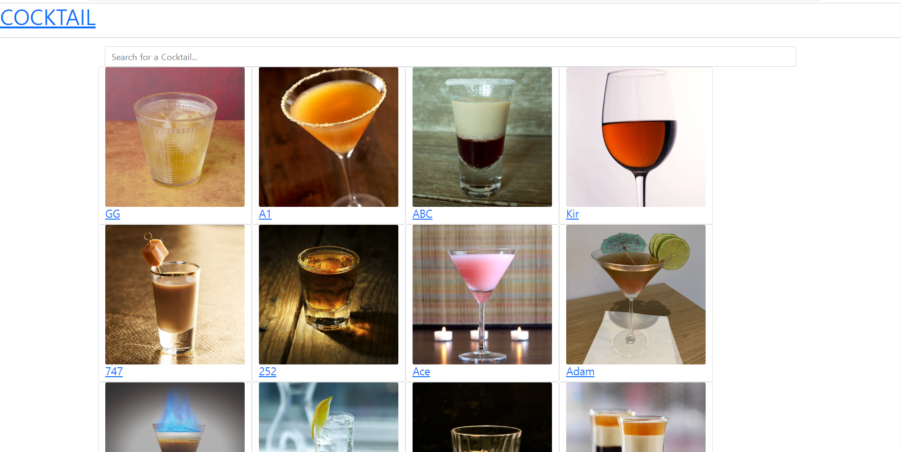
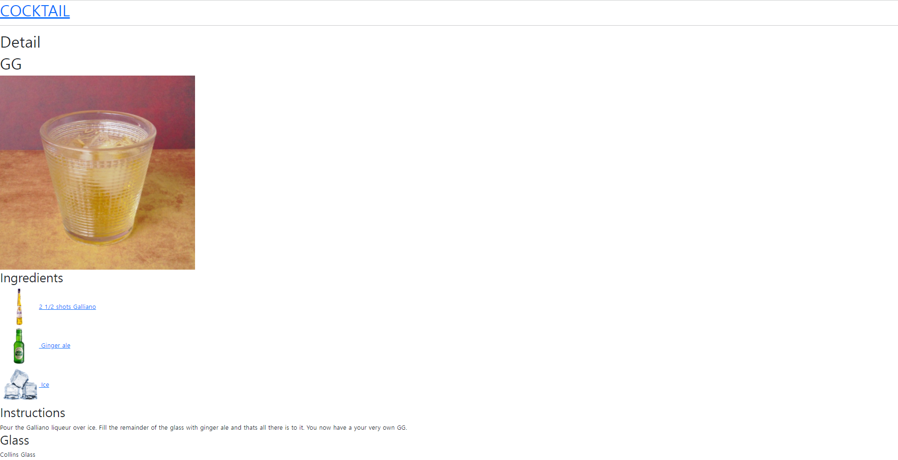
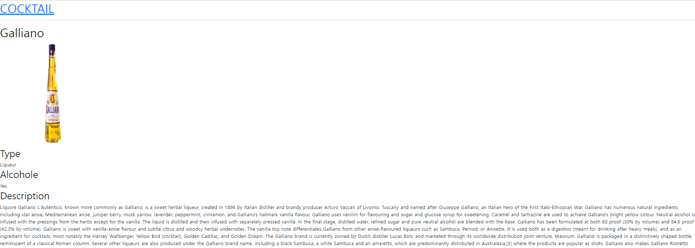

## 구현내용

### 1. 메인페이지

- 맨 위 COCKTAIL을 클릭하면 해당 페이지인 메인페이지로 이동

- 검색창에 칵테일 이름을 치면 input값이 바뀔 때마다 페이지가 렌더링되어 칵테일을 검색

- 칵테일 그림 혹은 이름을 클릭하면 칵테일 상세페이지로 이동

 

### 2. 칵테일 상세페이지

- useParams를 이용하여 url에서 칵테일 id를 받아와 API를 가져와 해당 칵테일 json을 받아옴
- 칵테일마다 재료의 개수가 다르기 때문에 삼항연산자를 이용하여 해당 번호 재료가 있으면 재료 표시, 없으면 null로 아무것도 반환하지 않도록 함
- 재료를 클릭하면 재료 상세페이지로 이동

### 3. 재료 상세페이지

- useParams를 이용하여 url에서 재료 이름을 받아와 API를 가져와 해당 재료 json을 받아옴

### 느낀점

중간 발표에서 현재까지 다른 스터디원들의 구현 내용을 들을 수 있었다. 나는 다른 스터디원들과는 다르게 API를 사용하였는데, 너무 많은 기능을 가진 API를 사용하니 스스로 구현한 기능이 매우 적다고 느껴져서 아쉬웠다. 남은 기능인 알파벳으로 칵테일 나열하기를 구현한 후에 css 요소를 좀 더 다양하게 추가하여 멋진 웹사이트를 만들고 싶다!

